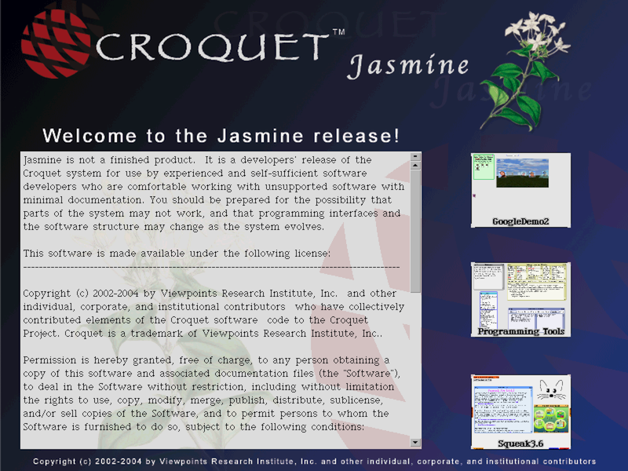

# Croquet Jasmine (2004)

Live version: [codefrau.github.io/jasmine](https://codefrau.github.io/jasmine/)

This is a version of Croquet Jasmine running on the [SqueakJS](https://squeak.js.org) virtual machine.
Here is an [early demo of the system](https://www.youtube.com/watch?v=cXGLOiZUZ2U) from 2003.
Alan Kay used it for his [Turing Award lecture in 2004](https://tinlizzie.org/IA/index.php/Alan_Kay_Turing_Award_Lecture_(2004)) (jump to 1 hour in for the Croquet part, but the whole thing is worth a watch).
While working on that demo, David Smith posted some blog entries
([1](https://www.croquet.zone/2004/10/turing-lecture-add-gravity.html),
[2](https://www.croquet.zone/2004/10/turing-lecture-change-spring-constant.html),
[3](https://www.croquet.zone/2004/10/turing-lecture-add-wind.html),
[4](https://www.croquet.zone/2004/10/turing-lecture-release.html),
[5](https://www.croquet.zone/2004/10/turing-lecture-oh-canada.html)), with screenshots uploaded to his [Flickr album](https://www.flickr.com/photos/87951975@N00/with/4343400).

This is work-in-progress. Contributions are very welcome.

— Vanessa Freudenberg, December 2023

## How to launch the Demos

By default, only the "SampleTeapot" morph is running, which only has a mirror in it (portals are a big part of Croquet, and a mirror is basically a portal into the same world).

Close that morph: You are in Squeak Smalltalk, everything onscreen is a Morph, and every morph has a "halo" you can bring up using the middle mouse button on a three-button mouse, or cmd-click (Mac) / alt-click (PCs). The top-left pink halo handle with an X will close. The other handles have mouse-over balloon help.

Drag out the full "Teapot" from the green objects tool. It will start downloading a lot of content. Please wait patiently until everything is loaded (the reading glasses cursor will disappear). At some point there will be a sound, when a blue status line will appear at the bottom of the 3D teapot morph. It's only truly finished when that statusline disappears again.

Save the image – that is a Smalltalk term for storing a snapshot of your whole current environment. By doing this, we won't have to wait as long the next time. Click on the gray background, which will pop up a "World" menu. I'd suggest using "Save as..." and give it a name different than "BridgeDemo.image" so you can easily go back to that one. When you reload your browser page, it will by default load the BridgeDeo image again. But you can load the image you saved by appending `?image=myimage.image` to the URL (assuming you named your image `myimage`).

Note that there are other interesting Teapot morphs in the objects tool you might want to explore.

## Things to do

### Move around

Use the right mouse button (or two-finger click on MacBooks) to move. This works like a joystick – the further from the screen center, the faster you move or turn.

### Icons

**Donut button (top-left):** brings up the morphic halo (useful when you're in full-screen)

**Camera button (top-right):** takes a snapshot to return to this position later

**Telephone button (right-center):** starts a call (not workign yet)

### Dock

Move your mouse pointer towards the lower edge of the 3D window. Various items will slide in from the bottom:

**Projects:** These are various projects (a.k.a. desktops) you can jump to. Use the World menu's "previous project" or "jump to project..." entries to go back.

**Snaphots:** Here are "snapshots" of the different spaces you can jump to. Use the camera button to create your own, to easily get back to a certain view. When you hover your pointer longer over one of the spaces, it actually shows a live view of that space (you would only notice that if somehthing is movign inside, of course).

**Tools:**

* TPainter lets you paint a 3D object – press keep to turn it into a balloon-animal like shape. The "?" button at the top will show a library of previous paintings (a.k.a. sketches).
* TSpaceBrowser shows a hierarchical view of all TObjects in the space.
* TConnectionDialog used to allow collaboration via the network (not supported yet in this revival)

**Alice:** a library of 3D models from Randy Pausch's Alice project at CMU. Click one to import, then move backwards to see it. If there is an error, close the pink error window and try a different one.

### TWindows

These hold additional spaces, in 3D or 2D. The blue window frame highlights in green when moving the mouse pointer over it. The window frame is active:

* top edge: move window left/right and up/down
* bottom edge: move window left/right and forwards/backwards
* left/right edge: rotate window (release while moving to make it spin)
* corners: resize

Hovering reveals a few buttons floating above:

* X: close
* Camera: create a snapshot
* Arrow: jump in front of that window so that it fills your whole view (useful for 2D windows in particular)
* Hand: grab a window – it will stay with you when you move (even when moving through a portal to a different space). Click the hand again to release
* Plus/Minus: show/hide the contents of that window

## Spaces

In the far back of this space are two 2D windows, one with the "drive a car" tutorial, the other showing a chess game.

In the front there are 6 windows, each showing one of the people working on Croquet in various capacities. From left to right:

### Mars

(Photo: [Mark](https://en.wikipedia.org/wiki/Mark_P._McCahill))
Click the rover to mount/unmount, or use the f/b keys so change the forwards/backwards speed, and l/r keys to change the left/right steering.

### 3 body simulation (Earth, Moon, 3rd)

(Photo: [David Reed](https://en.wikipedia.org/wiki/David_P._Reed))
Press 1/2/3 to make the third body move at different speeds, and observe its blue trajectory path. Press space to reset.

### Underwater

(Photo: [Andreas Raab](https://en.wikipedia.org/wiki/Andreas_Raab))
This is a world with tutorials on how to make your own fish and make it swim.

### Waves

(Photo: [Alan Kay](https://en.wikipedia.org/wiki/Alan_Kay))
Click and drag inside the window to create waves.

### Aqueduct

(Photo: [David Smith](https://en.wikipedia.org/wiki/David_A._Smith_(computer_scientist)))
A game-like world with a moving waterfall.

### Spreadsheet

(Photo: [Julian Lombardi](https://en.wikipedia.org/wiki/Julian_Lombardi))
A spreadsheet.

## Hack

This is a full [Squeak](https://squeak.org) Smalltalk environment. All the tools to modify it are included – like a system browser, senders/implementers tools etc. Feel free to experiment!

It's running on [SqueakJS](https://squeak.js.org), a Smalltalk virtual machine written in JavaScript. The original virtual machine was a 32 bit executable that on many modern achines does not work anymore.

It uses plugins for various tasks, and I (Vanessa) had to write a few new ones to support Croquet Jasmine. In particular, these are the [Balloon3D Accelerator Plugin](jasmine-b3daccel-plugin.js), [Balloon3D Engine Plugin](jasmine-b3dengine-plugin.js),
[MPEG3Plugin](jasmine-mpeg3-plugin.js), and [OpenGL](jasmine-opengl.js).
The latter is not a full plugin but provides an emulation of OpenGL functions for WebGL.

If we get these complete, they should be upstreamed to SqueakJS. But at the moment I'm just trying to implement the parts that are needed to get Croquet working.

One big thing I have not started working on yet is collaboration – the original was fully collaborative. My plan is to write a special SocketPlugin that emulates a LAN using [modern Croquet](https://croquet.io) as transport. The existing SqueakJS SocketPlugin only allows http/https connections.
